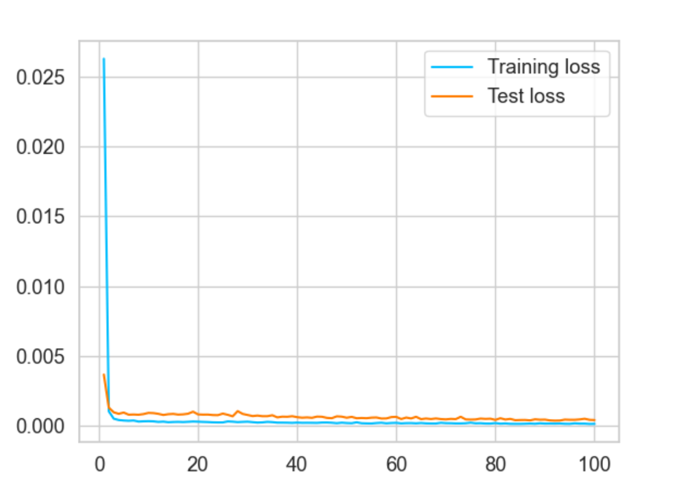
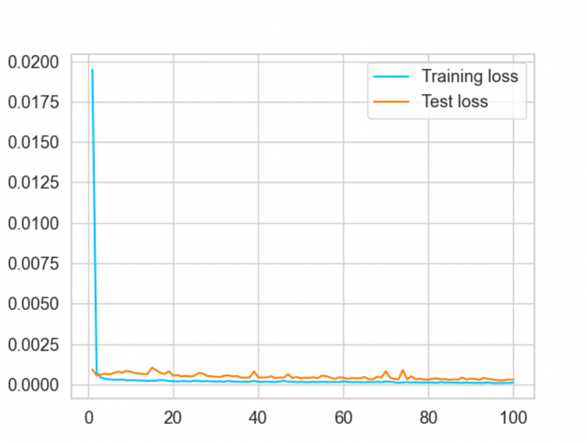

# 📈 RNN-based Model for Financial Stock Market Data 🚀

Welcome to the **Recurrent Neural Network (RNN) Models for Financial Stock Market Data** repository! 🎉 
This project is designed to help you train and test a Long Short-Term Memory (LSTM) and a Gated Recurrent Unit (GRU)
neural network on financial stock market data. This repository is highly inspired from 
[geeks4geeks](https://www.geeksforgeeks.org/time-series-forecasting-using-pytorch/) tutorial. 
Whether you're a seasoned data scientist or just starting out (like me 🤗), this repository will guide you through the
process of building a RNN-based predictive model for stock prices using PyTorch. 📊

---

## 🌟 Introduction

In this project, we leverage the power of **R**ecurrent **N**eural **N**etwork (**RNNs**) to predict future stock 
prices of Yahoo Finance based on historical data. 
We explore LSTMs and GRUs which are a type of Recurrent Neural Network (RNN) that are particularly well-suited for 
time series forecasting, making them an excellent choice for financial data analysis. 📈

---

### **LSTM (Long Short-Term Memory)** 🧠
- **What it is**: LSTM is a type of Recurrent Neural Network (RNN) designed to handle long-term dependencies in sequential data.
- **Key Features**:
  - Uses **memory cells** to store information over time.
  - Employs **three gates**:
    - **Input Gate**: Decides what new information to store.
    - **Forget Gate**: Decides what information to discard.
    - **Output Gate**: Decides what information to output.
  - Excels in tasks like time series forecasting, speech recognition, and text generation.
- **Strengths**: Handles long sequences well and avoids the vanishing gradient problem.

---

### **GRU (Gated Recurrent Unit)** ⚙️
- **What it is**: GRU is a simplified version of LSTM, also designed to address the vanishing gradient problem in RNNs.
- **Key Features**:
  - Uses **two gates**:
    - **Update Gate**: Decides how much past information to keep.
    - **Reset Gate**: Decides how much past information to forget.
  - Combines the cell state and hidden state into a single state, making it computationally more efficient than LSTM.
- **Strengths**: Faster to train and requires fewer parameters, while still performing well on many sequential tasks.

---

## 🛠 Features

- **Data Preprocessing**: Clean and normalize Yahoo stock market data for optimal model performance. 🧹
- **RNN Model**: Implement a state-of-the-art LSTM and GRU network for time series prediction using PyTorch. 🧠
- **Training & Testing**: Train the model on historical data and evaluate its performance on unseen data. 🧪
- **Visualization**: Generate insightful visualizations of training and testing performance. 📊

## 🚀 Installation

To get started, clone this repository and install the required dependencies with 
the `requirements.txt` file.

```bash
git clone https://github.com/Emerald072/RNN-time-series-forcasting.git
cd RNN-time-series-forcasting
pip install -r requirements.txt
```

## 🎯 Usage
To run the script, just run the `main.py` file. 
In future, arguments can be passed directly (see [issue#1](https://github.com/Emerald072/RNN-time-series-forcasting/issues/1)) 
```bash 
python main.py
```

## 🧪  Training and Testing Results
We train both a LSTM and GRU model on the Yahoo Dataset with the following 
configuration:
- Number of RNN layers: 3
- Dropout: 0.3
- Batch size: 128
- Optimizer: Adam
- Learning rate: 0.001
- Number of Epochs: 100

### 📈 LSTM Training/Testing (RMS) Loss

### 📈 GRU Training/Testing (RMS) Loss



